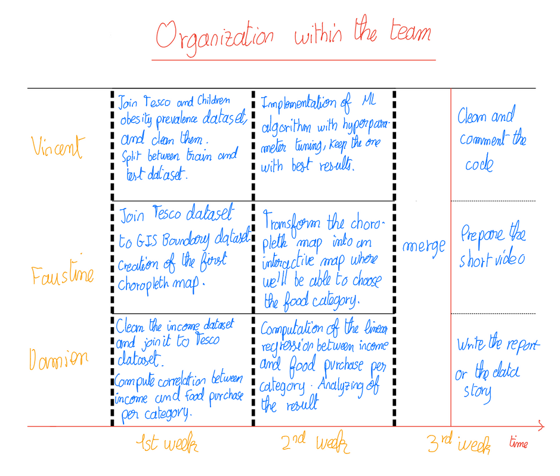

# Milestone P3, ADA 2020 Project, P-ADA-wan

## Title
Predicting children obesity risk from shopping basket, visualizing food consumption across London and creating a correlation between food purchase and income

## Abstract

With a dataset as huge as the one we have on a topic as important as food consumption, the researchers confirmed the correlation between obesity risk and alimentation. 

With this correlation already established, we would like firstly to extend this study by applying a Machine Learning model to determine the risk of child obesity of a person given his shopping basket. 

In a second time, we would like to discover the eating habits disparities given geographical areas if they exist. We will use Choropleth maps to be able to visualize the proportion of purchase of each food category given a geographical area. 

With this visualization at our disposal, we’ll discover if this food habits disparity is linked to an income disparity across geographical zones. We would then join our existing dataset to a new one that links income and geographical areas in London, to find if a correlation exists between income and food consumption. 

## Research Questions

Can we predict the obesity risk of a child given his shopping basket ? If we can, what would be the accuracy?

Is there a geographical disparity between the proportion of purchase of each food category, and how can we visualize it?

Does a correlation exist between the income and the proportion of purchase of food categories in a shopping basket?

## Proposed dataset 

[Paper's dataset](https://figshare.com/collections/Tesco_Grocery_1_0/4769354/2):  
We will need both the Tesco Datasets and the children obesity prevalence one. As there are some cells filled with NA in the children obesity prevalence dataset, we would need to clean the data first. We decided to take children obesity dataset, as the obesity dataset didn't have a sufficient amount of datapoints to infer a good ML model.

[ Household Income Estimates for Small Areas](https://data.london.gov.uk/dataset/household-income-estimates-small-areas): 
We want to discover if there’s a link between food consumption and average income. We will easily use these datasets as they are ready to process, even though we’ll need to get rid of the ‘£’ sign. One asset of this dataset is that there’s one file for each granularity level, just as in the Tesco dataset.

[Statistical GIS Boundary Files for London](https://data.london.gov.uk/dataset/statistical-gis-boundary-files-london): 
This dataset enables us to link the geographical areas in London into coordinates in order to create a visualization of London and its sub divisions for our Choropleth maps. We already tested this dataset and we managed to create a scratch visualization of London.      

## Methods: 

* **Data collection**: We will need to merge the Tesco dataset, children obesity prevalence dataset, GIS boundary and income’s dataset on area id. To do so, we will need to preprocess and clean the datasets (e.g. removing NA values or unneeded characters)
* **Machine Learning**: We will use machine learning to predict children obesity prevalence. We will use data preprocessing tricks : features selection, transformation of skewed features if there are, normalization of the data and the other usual data preprocessing for machine learning we’ve seen in class. Then, we will apply different supervised machine learning algorithms to our labeled data. We will need to find the best hyperparameters using cross validation as seen in class. 
* **Data visualization** : We will use the GeoPandas library of Python and  Statistical GIS Boundary Files for London dataset to create an interactive Choropleth map of London, where we will be able to visualize the distribution of purchase of each food category based on the area. 
* **Data analysis** : Once we’ll join the Tesco Dataset to the income one, we will analyze their relationship to extract a correlation if it exists. If we find that those variables are correlated, we will then dig deeper into it by using linear regression as a data analysis tool.

## Proposed timeline

In week 1, Vincent will take care of making the train and test sets. He will also label each datapoint by doing a join with the children obesity prevalence dataset. 
Faustine will create the first choropleth map of London, by using the GIS dataset and joining it to the Tesco one.
Damien will process the income dataset, and compute the correlation between income and food category proportion per category after joining the two datasets.

In week 2, Vincent will try several Machine Learning algorithms to find the one giving the best results, using hyperparameter tuning.
Faustine will transform her choropleth map into an interactive one, where one will be able to choose the desired food category. 
Damien will study more precisely the correlation between income and food purchase by making a linear regression and analyze the result. 

In week 3, we will merge our work. Then, Damien will take care of the report or the data story. Vincent will clean the code, and Faustine will prepare the short video.

## Organization within the team 

## Questions for TAs

* Would it make sense to compute the linear regression between income and food consumption even if we find no correlation during the first step ? 
* We are planning to do our analysis for the income relationship and the data visualization on food categories as they were not used in the initial dataset. Should we also look at the typical product or is it fine if we stick to main food categories ? 

